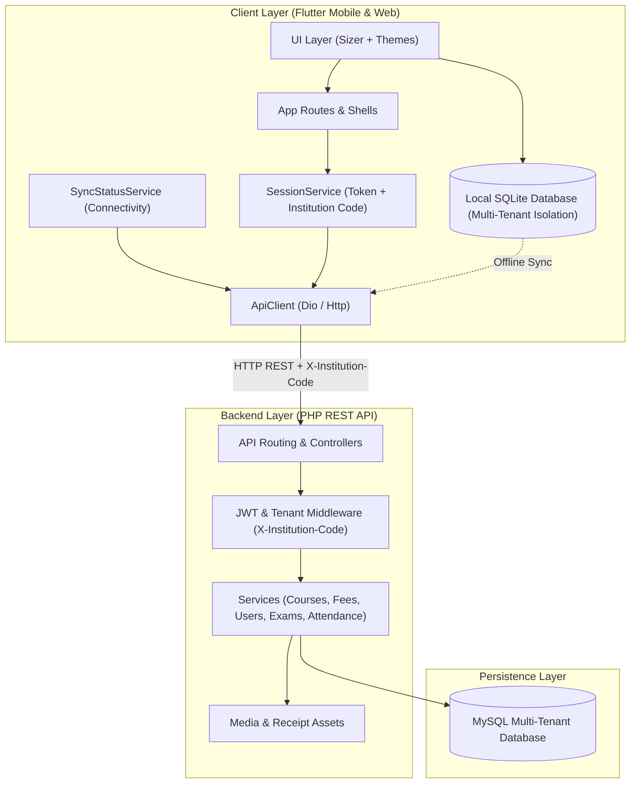

# 🎓 EduTenant LMS

[](https://flutter.dev)
[](https://dart.dev)
[](https://www.php.net)
[](https://www.mysql.com)
[](https://flutter.dev)
[](#-architecture-overview)

**EduTenant LMS** is a full-stack, enterprise-grade, **Multi-Tenant Learning Management System (LMS)** engineered for educational institutions, colleges, schools, and training academies. Built with a responsive **Flutter** mobile/web application and an extensible **PHP & MySQL REST API**, EduTenant provides complete tenant isolation, offline-first data synchronization, biometric security, and comprehensive academic administration.

---

## 📑 Table of Contents

- [Key Features](#-key-features)
- [System Architecture](#-system-architecture)
- [Multi-Tenancy & Security](#-multi-tenancy--security)
- [Role-Based Access Control (RBAC)](#-role-based-access-control-rbac)
- [Tech Stack](#-tech-stack)
- [Project Directory Structure](#-project-directory-structure)
- [Getting Started](#-getting-started)
  - [Prerequisites](#prerequisites)
  - [Backend Setup (PHP & MySQL)](#1-backend-setup-php--mysql)
  - [Frontend Setup (Flutter)](#2-frontend-setup-flutter)
- [REST API Reference](#-rest-api-reference)
- [Offline Synchronization & Local Database](#-offline-synchronization--local-database)
- [Theming & Responsive Design](#-theming--responsive-design)
- [License](#-license)

---

## 🌟 Key Features

- **🏢 Multi-Tenant Architecture**: Dynamic institution onboarding using unique `institution_code`. Automatic tenant logo, primary branding color, and module-level permission resolution.
- **📶 Offline-First Resilience**: Full local data persistence via SQLite (`DatabaseHelper`). Automatic sync detection (`connectivity_plus`) with background synchronization status indicators.
- **🔐 Biometric Authentication**: Quick, secure app unlocking with fingerprint and face recognition via `local_auth`.
- **📊 Interactive Analytics & Dashboards**: Dedicated views for Platform Admins, Institution Admins, Instructors, and Students with data visualizations powered by `fl_chart`.
- **💬 Rich Discussion Forums**: Threaded discussions featuring rich-text formatting (`flutter_quill`), speech-to-text dictation (`speech_to_text`), voice recordings (`record`), and emoji reactions.
- **💳 Fee Management & Automated PDF Receipts**: Fee structure tracking, cash payment processing, and instant on-device generation and direct printing of branded PDF receipts (`pdf`, `printing`).
- **📝 Assignments & Examinations**: Assignment workflow with attachments (`file_picker`, `image_picker`), grading rubrics, exam schedules, and student report cards.
- **📅 Smart Attendance Tracking**: Course-level attendance, individual student records, and high-efficiency bulk attendance marking.
- **🎨 Dynamic Theming & Responsiveness**: Sizer-based fluid layouts across phones and tablets with instant Light/Dark mode toggling via `Provider`.

---

## 🏛️ System Architecture

EduTenant LMS follows a client-server architecture with multi-tenant data partitioning at both the client SQLite cache layer and the server-side relational database.



---

## 🏢 Multi-Tenancy & Security

Each institution operates as an isolated tenant inside EduTenant LMS:

1. **Institution Code Binding**: Upon launch, the app prompts for the institution's unique code (or restores it from encrypted local storage).
2. **Dynamic Theming & Branding**: The app retrieves the institution's logo, color palette, and allowed feature modules from `/api/v1/institutions/{code}`.
3. **Tenant-Scoped Requests**: All API calls inject the tenant header:
   ```http
   X-Institution-Code: INST001
   ```
4. **Local Data Isolation**: The local SQLite database enforces an `institution_code` foreign key and composite unique constraints across all tables (users, courses, fees, exams).
5. **Session Security**: State is securely handled with biometric validation (`local_auth`) and JWT authentication tokens.

---

## 👥 Role-Based Access Control (RBAC)

EduTenant supports 5 distinct user roles with dedicated interfaces and permission boundaries:

| Feature / Screen | Platform Admin | Institution Admin | Instructor | Student | Parent |
| :--- | :---: | :---: | :---: | :---: | :---: |
| **Institution Onboarding & Setup** | ✅ | ❌ | ❌ | ❌ | ❌ |
| **Subscription & Global Analytics** | ✅ | ❌ | ❌ | ❌ | ❌ |
| **User & Role Access Management** | ❌ | ✅ | ❌ | ❌ | ❌ |
| **Campus Announcements** | ❌ | ✅ | ❌ | ❌ | ❌ |
| **Fee Structure & Cash Processing** | ❌ | ✅ | ❌ | ❌ | ❌ |
| **Course Catalog Administration** | ❌ | ✅ | ❌ | ❌ | ❌ |
| **Bulk Attendance Taking** | ❌ | ✅ | ✅ | ❌ | ❌ |
| **Course Progress & Syllabus Mgmt** | ❌ | ✅ | ✅ | ❌ | ❌ |
| **Assignment Creation & Grading** | ❌ | ❌ | ✅ | ❌ | ❌ |
| **Discussion Forum Moderation** | ❌ | ✅ | ✅ | ❌ | ❌ |
| **Assignment Submissions (File/Text)**| ❌ | ❌ | ❌ | ✅ | ❌ |
| **Student Attendance & Report Cards**| ❌ | ❌ | ❌ | ✅ | ✅ |
| **Fee Status & Downloadable Receipts**| ❌ | ❌ | ❌ | ✅ | ✅ |
| **Discussion Forum Participation** | ❌ | ❌ | ✅ | ✅ | ❌ |

---

## 💻 Tech Stack

### Frontend (Mobile & Web)
- **Framework**: [Flutter](https://flutter.dev) (Dart SDK `^3.6.0`)
- **State Management**: [Provider](https://pub.dev/packages/provider)
- **Responsive Design**: [Sizer](https://pub.dev/packages/sizer)
- **Networking**: [Dio](https://pub.dev/packages/dio) & [Http](https://pub.dev/packages/http)
- **Local Persistence**: [sqflite](https://pub.dev/packages/sqflite) & [shared_preferences](https://pub.dev/packages/shared_preferences)
- **Biometric Security**: [local_auth](https://pub.dev/packages/local_auth)
- **Document & PDF Generation**: [pdf](https://pub.dev/packages/pdf), [printing](https://pub.dev/packages/printing), [open_filex](https://pub.dev/packages/open_filex)
- **Rich Media & Audio**: [flutter_quill](https://pub.dev/packages/flutter_quill), [speech_to_text](https://pub.dev/packages/speech_to_text), [record](https://pub.dev/packages/record)
- **Data Visualization**: [fl_chart](https://pub.dev/packages/fl_chart)

### Backend (RESTful API)
- **Language & Runtime**: PHP 8.x
- **Database Engine**: MySQL 8.x / MariaDB
- **Authentication**: JWT (JSON Web Tokens) & PHP `password_hash()`
- **Routing & Server**: Apache (`.htaccess` URL rewriting) / Nginx reverse proxy
- **File Storage**: Multi-tenant media upload directory (`uploads/`)

---

## 📂 Project Directory Structure

```
edutenant_lms/
├── lib/                               # Flutter application source code
│   ├── main.dart                      # App entrypoint (initialization & providers)
│   ├── core/                          # Global configs, theme controller & exports
│   ├── database/                      # Offline SQLite storage engine
│   │   ├── database_helper.dart       # SQLite database schema, tables & queries
│   │   ├── models/                    # Typed models (courses, fees, exams, users, etc.)
│   │   └── repositories/              # Local data repository pattern implementations
│   ├── presentation/                  # Screen views & UI presentations
│   │   ├── admin_dashboard/           # Institution administrator overview
│   │   ├── admin_course_management/   # Admin course catalog & syllabus management
│   │   ├── assignment_detail/         # Assignment viewing, submission & grading
│   │   ├── attendance_management/     # Single & bulk attendance tracking
│   │   ├── cash_payment_management/   # Offline & manual cash receipt recording
│   │   ├── coursedetailpage.dart      # Course curriculum & syllabus screen
│   │   ├── discussion_forum/          # Rich forum with voice & text reactions
│   │   ├── exams_results/             # Exam scheduling & student report cards
│   │   ├── fees_management/           # Student fee ledgers & printable PDF receipts
│   │   ├── institution_management/    # Super Admin tenant listing & setup
│   │   ├── instructor_dashboard/      # Faculty dashboard & course overviews
│   │   ├── login_screen/              # Multi-tenant login with biometric authentication
│   │   ├── platform_admin_dashboard/  # Global platform administrator dashboard
│   │   ├── profile_settings/          # User profile, theme settings & biometric toggle
│   │   ├── student_dashboard/         # Student portal (courses, tasks, stats)
│   │   ├── student_report/            # Detailed academic performance report
│   │   └── user_management/           # User lifecycle & RBAC assignments
│   ├── routes/                        # Named application navigation routes
│   ├── services/                      # Remote API client services & sync status
│   │   ├── api/                       # API clients for all backend modules
│   │   └── sync_status_service.dart   # Connectivity monitor & offline queue manager
│   ├── theme/                         # Light and dark theme palettes
│   ├── utils/                         # Role utilities, formatters and helpers
│   └── widgets/                       # Reusable UI components (AppBars, Drawers, Badges)
│
├── edutenant_lms_backend/             # Custom PHP Backend REST API
│   ├── api/                           # Endpoint controllers (auth, courses, fees, etc.)
│   ├── config/                        # Database credentials & JWT configurations
│   ├── database/                      # MySQL database schema (schema.sql)
│   ├── includes/                      # Common utilities, response formatters & security
│   ├── uploads/                       # Tenant media & logo upload directory
│   ├── .htaccess                      # Apache URL rewrite rules
│   └── README.md                      # Dedicated backend setup & API documentation
│
├── assets/                            # Application icons, fonts & default graphics
├── pubspec.yaml                       # Flutter dependencies & asset configurations
└── README.md                          # Project documentation (this file)
```

---

## 🚀 Getting Started

### Prerequisites

- **Flutter SDK**: `^3.6.0` or higher ([Install Flutter](https://docs.flutter.dev/get-started/install))
- **Dart SDK**: Compatible with Flutter SDK
- **PHP**: `^8.0` with `pdo_mysql`, `mbstring`, `fileinfo` enabled
- **MySQL / MariaDB**: `^8.0`
- **Web Server**: Apache (with `mod_rewrite`) or Nginx

---

### 1. Backend Setup (PHP & MySQL)

1. **Import Database Schema**:
   Create a new database named `edutenant_lms` and import the schema file:
   ```bash
   mysql -u root -p edutenant_lms < edutenant_lms_backend/database/schema.sql
   ```

2. **Configure Database & Secrets**:
   Update `edutenant_lms_backend/config/database.php` with your MySQL credentials:
   ```php
   'host' => 'localhost',
   'database' => 'edutenant_lms',
   'username' => 'your_db_username',
   'password' => 'your_db_password',
   ```
   Set your JWT secret in `edutenant_lms_backend/config/config.php`:
   ```php
   define('JWT_SECRET', 'your_secure_jwt_secret_key');
   ```

3. **Set Upload Directory Permissions**:
   ```bash
   chmod 755 edutenant_lms_backend/uploads
   ```

4. **Verify API Setup**:
   Open your browser and navigate to:
   ```
   http://localhost/edutenant_lms_backend/verify_setup.php
   ```

---

### 2. Frontend Setup (Flutter)

1. **Install Dependencies**:
   ```bash
   flutter pub get
   ```

2. **Configure API Base URL**:
   The application defaults to the production endpoint or can be overridden via `API_BASE_URL`:
   ```dart
   // lib/services/api/api_config.dart
   static const String _envBaseUrl = String.fromEnvironment('API_BASE_URL');
   ```
   To run pointing to your local backend server:
   ```bash
   flutter run --dart-define=API_BASE_URL="http://10.0.2.2/edutenant_lms_backend/api"
   ```
   *(Note: Use `10.0.2.2` for Android Emulator, or your local machine IP for physical devices).*

3. **Run on Connected Device**:
   ```bash
   # Android / iOS
   flutter run

   # Web
   flutter run -d chrome
   ```

---

## 📡 REST API Reference

All requests (except `/institutions` registration) require the tenant header:
```http
X-Institution-Code: <INSTITUTION_CODE>
Authorization: Bearer <JWT_AUTH_TOKEN>
```

### Core API Endpoints

| Category | Method | Endpoint | Description |
| :--- | :--- | :--- | :--- |
| **Auth** | `POST` | `/api/v1/auth/login` | Authenticate user & retrieve JWT token |
| | `POST` | `/api/v1/auth/register` | Register new user under tenant |
| **Institutions** | `GET` | `/api/v1/institutions` | List all platform institutions |
| | `GET` | `/api/v1/institutions/{code}` | Retrieve tenant branding & module flags |
| | `POST` | `/api/v1/institutions` | Onboard a new institution |
| **Users** | `GET` | `/api/v1/users` | List tenant users (filter by role) |
| | `POST` | `/api/v1/users` | Create a new user profile |
| **Courses** | `GET` | `/api/v1/courses` | List enrolled or available courses |
| | `POST` | `/api/v1/courses` | Add a new course to the curriculum |
| **Assignments** | `GET` | `/api/v1/assignments` | List assignments for course |
| | `POST` | `/api/v1/assignments` | Create assignment with attachments |
| **Attendance** | `GET` | `/api/v1/attendance` | Fetch attendance records |
| | `POST` | `/api/v1/attendance/bulk` | Mark attendance in bulk for a class |
| **Exams** | `GET` | `/api/v1/exams` | View scheduled exams |
| | `POST` | `/api/v1/exams` | Schedule an examination session |
| **Fees** | `GET` | `/api/v1/fees` | View student fee dues & balance |
| | `POST` | `/api/v1/fees/payments` | Record a fee payment & receipt |
| **Discussions** | `GET` | `/api/v1/discussions` | List forum discussions & topics |
| | `POST` | `/api/v1/discussions/{id}/replies`| Post rich text or audio reply |

---

## 🔄 Offline Synchronization & Local Database

EduTenant ensures unhindered classroom productivity even when internet connectivity is intermittent:

- **Local Storage**: Powered by SQLite via [sqflite](https://pub.dev/packages/sqflite). All queries are indexed by `institution_code` and entity IDs.
- **Sync Status**: `SyncStatusService` continuously broadcasts the network state (`offline`, `syncing`, `synchronized`, `error`).
- **Sync Badge**: Visual real-time indicator (`SyncStatusBadge`) informs users when pending local changes are waiting for synchronization.

---

## 🎨 Theming & Responsive Design

- **Responsive Scaling**: Utilizes [sizer](https://pub.dev/packages/sizer) (`w`, `h`, `sp`) to maintain visual proportions seamlessly across mobile phones, foldables, and tablets.
- **Dark Mode Support**: Full light and dark themes built around high-contrast, accessible palettes.
- **State Management**: Theme changes persist in local storage and update reactively via `ThemeController` (`ChangeNotifierProvider`).

---

## 📄 License

This project is licensed under the MIT License - see the [LICENSE](LICENSE) file for details.
